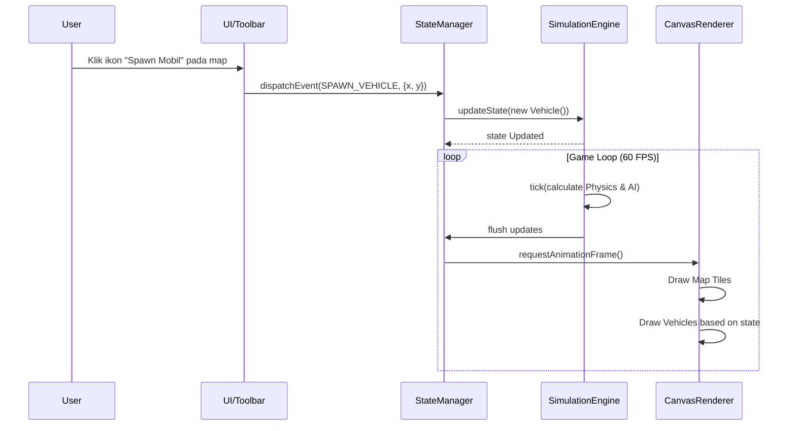
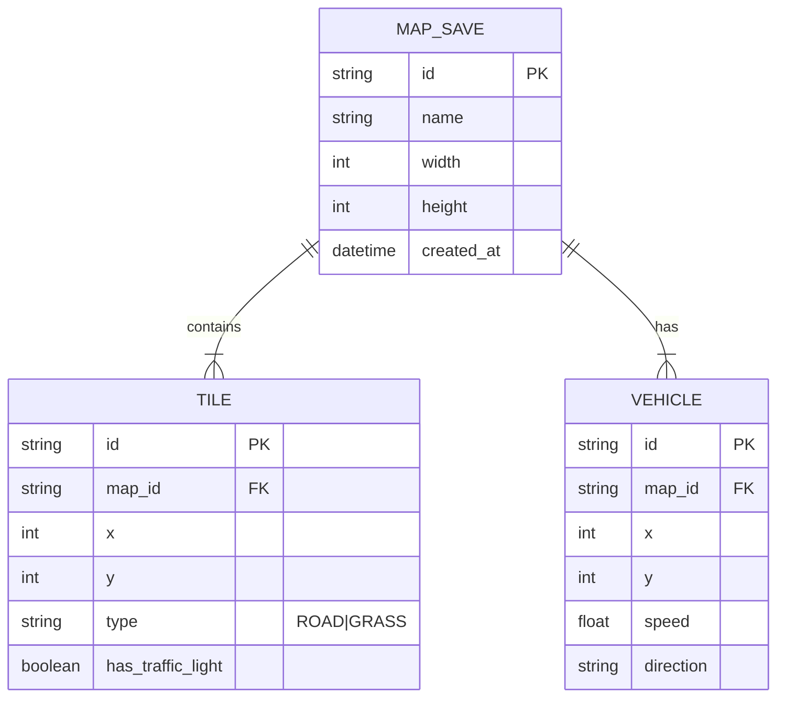

# Product Requirements Document (PRD): Traffic Jam Simulator 2D MVP

## 1. Overview
Traffic Jam Simulator 2D adalah sebuah aplikasi simulasi berbasis web (top-down view) yang dirancang untuk keperluan edukasi dan eksperimen mengenai kemacetan lalu lintas. Pengguna dapat memahami penyebab kemacetan dan menguji coba berbagai solusi melalui pengaturan lalu lintas, serta penataan jalan. Aplikasi ini menghadirkan pengalaman "Sandbox", di mana pengguna bebas merancang pola jalan, mengatur traffic light, dan mensimulasikan kendaraan cerdas dengan estetika retro/pixel art yang menarik.

**Tujuan:** 
Memberikan pemahaman visual tentang dinamika lalu lintas dan efek riak (ripple effect) dalam kemacetan melalui interaktivitas yang mudah digunakan.

---

## 2. Requirements
**Functional Requirements:**
- Pengguna dapat membangun dan menghapus ruas jalan di dalam sistem grid.
- Pengguna dapat meletakkan lampu lalu lintas di persimpangan.
- Pengguna dapat meletakkan atau menghapus kendaraan (mobil).
- Kendaraan memiliki AI untuk berjalan, berhenti, menjaga jarak (menghindari tabrakan), bermanuver menyalip, dan mencari rute alternatif.
- Pengguna dapat menjeda, melanjutkan, dan mempercepat waktu simulasi.
- Visualisasi berbasis 2D pixel art/retro.
- Terdapat indikator visual untuk area dengan kepadatan tinggi (analytics).

**Non-Functional Requirements:**
- **Performance**: Simulasi minimal 60 FPS untuk rendering hingga 200 kendaraan secara bersamaan.
- **Scalability**: Arsitektur yang modular sehingga mudah menambahkan tipe kendaraan baru atau elemen jalan kompleks di masa depan.
- **Usability**: Antarmuka yang intuitif layaknya tool menggambar (sandbox editor).

---

## 3. Core Features Berbasis Roadmap

### Fase 1: Core Simulation Engine (High Priority)
- Implementasi Grid & Tile System.
- Implementasi Game Loop (Time Management, Tick rate).
- Integrasi Pixel Art Renderer (menggambar tile jalan dasar).

### Fase 2: Sandbox & Map Editor (High Priority)
- Pembuatan sistem Toolbar (Mode Gambar, Mode Hapus).
- Fitur Road Builder (Penempatan tile jalan lurus dan persimpangan).
- Fitur Traffic Light Editor (Bisa di klik untuk mengubah durasi merah/hijau).
- Fitur Vehicle Spawner (Klik jalan untuk me-spawn mobil).

### Fase 3: Advanced Vehicle AI (High Priority)
- Sistem Smart Pathfinding (Kendaraan mencari jalan).
- Collision Avoidance System (Kendaraan mengerem jika ada mobil di depannya).
- Lane Management (Sistem berpindah jalur / overtaking jika jalan di depan lambat).

### Fase 4: UI/UX & Analytics Dashboard (Medium Priority)
- Panel kontrol utama (Play, Pause, Speed multiplier).
- Indikator heatmap / kemacetan (Warna jalan merah jika ada bottleneck).
- Dashboard statistik sederhana (Jumlah mobil aktif, rata-rata kecepatan).

---

## 4. User Flow
**Alur Observasi (Pengguna Standar):**
1. Pengguna membuka aplikasi.
2. Pengguna melihat canvas (grid) kosong.
3. Pengguna memilih ikon "Jalan" dari toolbar dan menggambar rute melingkar/persimpangan.
4. Pengguna menambahkan "Lampu Lalu Lintas" di titik temu persimpangan.
5. Pengguna beralih ke ikon "Mobil" dan meletakkan beberapa mobil di atas jalan.
6. Pengguna menekan tombol "Play" di panel kontrol.
7. Mobil-mobil mulai bergerak.
8. Pengguna mengamati dan mengubah warna lampu lalu lintas untuk melihat reaksi kendaraan.
9. Pengguna melihat fitur "Heatmap Analytics" yang menyala ketika kemacetan terjadi.

---

## 5. Architecture & Sequence Diagram
Sistem ini menggunakan arsitektur event-driven antara Simulation Engine dan UI. State aplikasi disimpan di StateManager pusat, sementara Renderer mengambil data state untuk dirender di HTML Canvas setiap frame.

---

## 6. Database Schema
Karena ini adalah MVP berbentuk simulasi klien (frontend-heavy), tidak memerlukan database relasional kompleks yang beroperasi di backend. Namun, jika ada fitur menyimpan "Peta (Map Save)", berikut adalah struktur penyimpanan modelnya.

---

## 7. Tech Stack
- **Frontend Framework**: HTML5 murni + Vanilla JavaScript (untuk menghindari overhead state management yang berat dari virtual DOM React saat render canvas).
- **Rendering**: HTML5 Canvas 2D API (cocok untuk rendering pixel art dalam jumlah banyak secara performan).
- **Styling**: CSS Variables (untuk styling UI/Toolbar dengan gaya Minimalis-Retro).
- **State Management**: Custom Event System / Observer Pattern (Vanilla JS).
- **Bundler (Optional)**: Vite (untuk kemudahan development server dan build).
